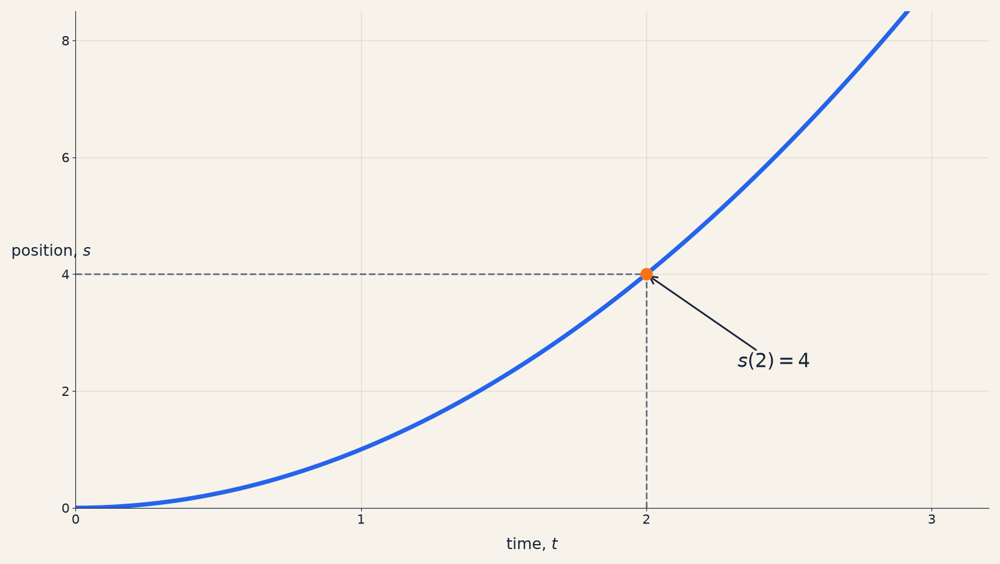
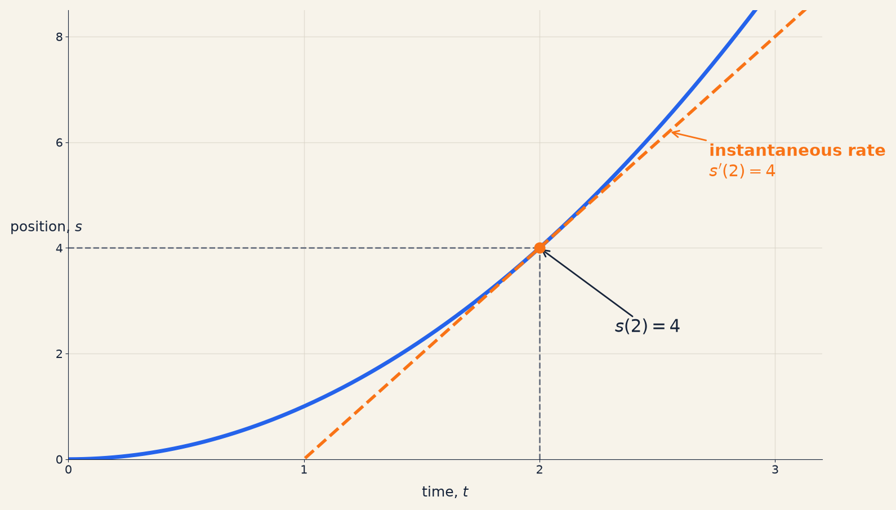
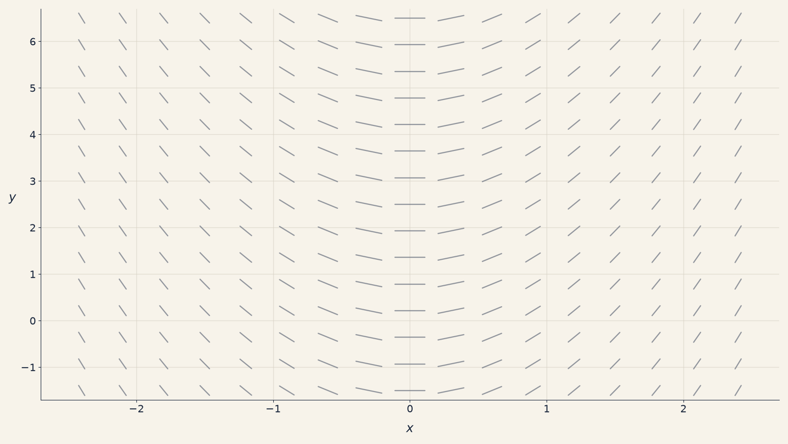
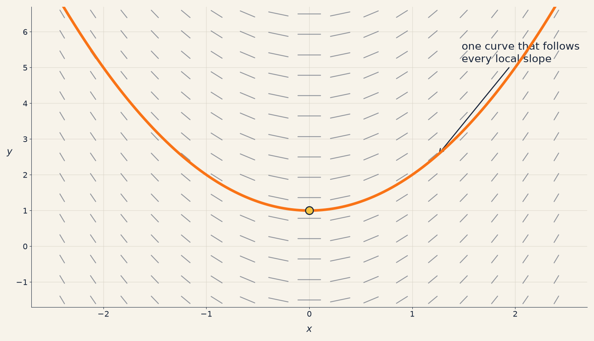
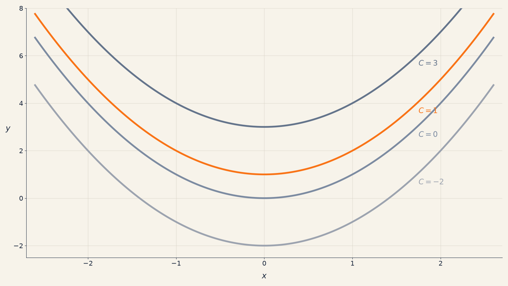
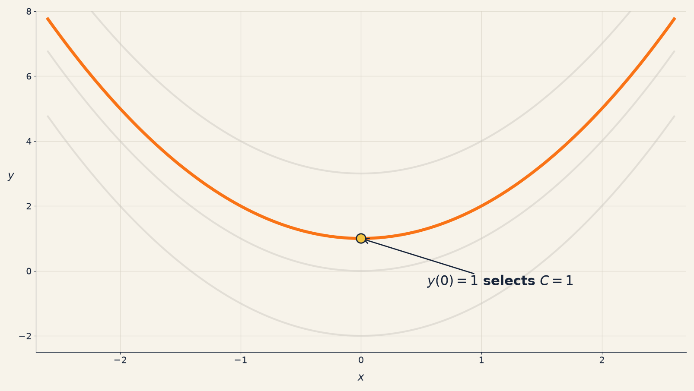

# Presentation 1 — What Is a Differential Equation?

The text under each slide state is the exact content shown to the audience. The **Speaker introduction** provides the verbal transition into the slide before its initial content is revealed. Each **Say** prompt is delivered while the content immediately above it is visible. Every reveal adds content; nothing already visible is removed.

---

## Slide 1 — What Is a Differential Equation?

### Speaker introduction

> “Before looking at any notation, let us begin with the central idea. Differential equations are about functions whose values change, and about using information on that change to determine the function.”

### Initially visible

# What Is a Differential Equation?

A differential equation relates an unknown function to one or more of its derivatives.

It tells us how the function changes. Solving the equation means finding a function that changes in that way.

**Say**

> “A differential equation connects a function we do not yet know with information about how that function changes. Our aim is to find a function whose behaviour matches the equation.”

---

## Slide 2 — From a Missing Number to a Missing Function

### Speaker introduction

> “A useful way to understand a differential equation is to compare it with an ordinary algebraic equation. The comparison shows that the main difference is not simply the notation—it is the kind of unknown we are trying to find.”

### Initially visible

# From a Missing Number to a Missing Function

$$
2u+3=11
$$

The unknown $u$ is one number. Solving the equation gives $u=4$.

**Say**

> “This is a familiar algebraic equation. The unknown is one number, and once we find that number, the problem is complete.”

### First reveal

$$
\frac{dy}{dx}=2x
$$

The unknown is now the entire function $y(x)$.

Solving the differential equation gives the family of functions

$$
\boxed{y=x^2+C},
$$

where $C$ is any constant.

**Say**

> “In the differential equation, the unknown is no longer one fixed number. Solving gives the family $y=x^2+C$. Each value of $C$ produces a function whose derivative is $2x$. We will return later to why the answer contains a constant.”

### Second reveal

An algebraic equation asks:

> **Which number makes this statement true?**

A differential equation asks:

> **Which function has the required rate of change?**

**Say**

> “The essential difference is the kind of object we are trying to find: one number in the first case, and an entire function in the second.”

---

## Slide 3 — A Function Tells Us the Value

### Speaker introduction

> “To understand what a differential equation tells us, we first need to distinguish a function’s value from its rate of change. We will begin with the value.”

### Initially visible

# A Function Tells Us the Value

Suppose the position of an object is described by

$$
s(t)=t^2.
$$

At time $t=2$,

$$
s(2)=4.
$$

The function tells us that the object’s position is $4$ at that time.

**Say**

> “The function $s(t)$ gives the object’s position at each time. Substituting $t=2$ gives $s(2)=4$, so the position is $4$ at that instant.”

---

## Slide 4 — A Derivative Tells Us the Rate

### Speaker introduction

> “The previous slide told us where the object is. We will now use the same example to ask a different question: how quickly is its position changing?”

### Initially visible

# A Derivative Tells Us the Rate

The same position function is

$$
s(t)=t^2.
$$

Its derivative is

$$
s'(t)=2t.
$$

**Say**

> “The function gives position. Its derivative gives the rate at which that position changes.”

### First reveal

At time $t=2$,

$$
s'(2)=4.
$$

The object’s position is changing at an instantaneous rate of $4$.

**Say**

> “At time $2$, the derivative has value $4$. This is the object’s instantaneous rate of change at that moment.”

### Second reveal

The slope of the tangent line is the instantaneous rate of change.

**Say**

> “Graphically, the instantaneous rate is the slope of the tangent line. The tangent touches the curve at the point corresponding to $t=2$.”

### Third reveal

$$
\boxed{s(2)=4}
\qquad
\boxed{s'(2)=4}
$$

$s(2)$ tells us **the value**.

$s'(2)$ tells us **how quickly the value is changing**.

**Say**

> “The two numbers happen to be equal here, but they mean different things. The function value gives the position; the derivative gives the rate at which the position changes.”

---

## Slide 5 — Differential Equations Reverse the Question

### Speaker introduction

> “Now that we have separated a function from its derivative, we can see what makes a differential-equation problem distinctive: it begins with information about the derivative and asks us to recover the function.”

### Initially visible

# Differential Equations Reverse the Question

In ordinary differentiation, we begin with a function and calculate its derivative:

$$
\boxed{s(t)=t^2}
\quad\xrightarrow{\text{differentiate}}\quad
\boxed{s'(t)=2t}.
$$

**Say**

> “In ordinary differentiation, the function is known. We differentiate it to find its rate of change.”

### First reveal

In a differential-equation problem, we may begin with the derivative:

$$
\boxed{s'(t)=2t}
\quad\xrightarrow{\text{solve}}\quad
\boxed{s(t)=\ ?}
$$

**Say**

> “A differential equation reverses the problem. We know information about the rate of change, and we try to recover the original function.”

### Second reveal

We know **how the quantity changes**.

We want to determine **the quantity itself**.

**Say**

> “This is the central question of differential equations: which function changes in the way described by the equation?”

---

## Slide 6 — The Definition

### Speaker introduction

> “We now have enough intuition to introduce the formal definition. We will state it first in mathematical language and then translate it into plain English.”

### Initially visible

# The Definition

> A differential equation is an equation involving an unknown function and one or more of its derivatives.

**Say**

> “This is the formal definition. The unknown is a function, and the equation contains at least one derivative of that function.”

### First reveal

## In plain English

A differential equation is a clue about an unknown function, written in the language of change.

**Say**

> “In plain English, the derivative gives us a clue about how the unknown function behaves.”

### Second reveal

A differential equation contains:

- an **unknown function**;
- one or more **rates of change**;
- a relationship connecting them.

**Say**

> “When we inspect a differential equation, these are the three ingredients to look for: the unknown function, its derivatives, and the relationship between them.”

### Third reveal

The equation describes how the function must behave without necessarily giving the function directly.

**Say**

> “The equation gives a rule for the function’s behaviour. Solving means finding a function that obeys that rule.”

---

## Slide 7 — Inside a Simple Differential Equation

### Speaker introduction

> “The definition becomes clearer when we apply it to an actual equation. We will identify the unknown function, the input, and the rate-of-change rule one piece at a time.”

### Initially visible

# Inside a Simple Differential Equation

$$
\frac{dy}{dx}=2x
$$

The unknown is the function $y(x)$.

The input is $x$.

**Say**

> “The function $y(x)$ is unknown. Its value depends on the input $x$.”

### First reveal

$$
\frac{dy}{dx}
$$

is the instantaneous rate at which $y$ changes as $x$ changes.

**Say**

> “The derivative $\frac{dy}{dx}$ measures the instantaneous rate of change of $y$ with respect to $x$.”

### Second reveal

$$
\underbrace{\frac{dy}{dx}}_{\text{rate of change}}
=
\underbrace{2x}_{\text{required value of the rate}}.
$$

The equation requires the rate of change to equal $2x$.

**Say**

> “The right-hand side tells us exactly what the rate must be. At every input $x$, the slope of the unknown function must equal $2x$.”

### Third reveal

$$
\begin{aligned}
x=-1 &\quad\Longrightarrow\quad \frac{dy}{dx}=-2,\\
x=0  &\quad\Longrightarrow\quad \frac{dy}{dx}=0,\\
x=1  &\quad\Longrightarrow\quad \frac{dy}{dx}=2.
\end{aligned}
$$

The required slope changes as $x$ changes.

**Say**

> “The equation requires a negative slope at $x=-1$, a horizontal slope at $x=0$, and a positive slope at $x=1$. It supplies a slope instruction for every value of $x$.”

---

## Slide 8 — A More Complicated Differential Equation

### Speaker introduction

> “Real differential equations often contain more than one derivative. This example looks more complicated, but it contains the same basic ingredients as the simple equation.”

### Initially visible

# A More Complicated Differential Equation

$$
y''+3y'+2y=e^x
$$

The unknown is still one function: $y(x)$.

**Say**

> “This equation contains more terms, but we are still looking for one unknown function $y(x)$.”

### First reveal

$$
\underbrace{y}_{\text{function}}
\qquad
\underbrace{y'}_{\text{rate of change}}
\qquad
\underbrace{y''}_{\text{change of the rate}}.
$$

**Say**

> “The equation involves the function itself, its first derivative, and its second derivative.”

### Second reveal

The known expression $e^x$ is related to the unknown function through

$$
y''+3y'+2y=e^x.
$$

**Say**

> “The expression $e^x$ is already known. The equation requires the unknown function and its derivatives to combine to produce that known expression.”

### Third reveal

If $x$ is time and $y$ is position, then

$$
y=\text{position},
\qquad
y'=\text{velocity},
\qquad
y''=\text{acceleration}.
$$

**Say**

> “In a motion problem, the function could represent position, its first derivative velocity, and its second derivative acceleration. Other applications give these terms different interpretations.”

---

## Slide 9 — Different Notation, Same Meaning

### Speaker introduction

> “Before working with more examples, it is helpful to recognise the common ways derivatives are written. A change in notation does not mean that the underlying idea has changed.”

### Initially visible

# Different Notation, Same Meaning

The first derivative of $y(x)$ may be written as

$$
\frac{dy}{dx}
\qquad\text{or}\qquad
y'.
$$

Both describe the instantaneous rate at which $y$ changes with respect to $x$.

**Say**

> “These are two common ways of writing the first derivative. They represent the same rate of change.”

### First reveal

When the input is time, the derivative may also be written as

$$
\dot y.
$$

Therefore,

$$
\frac{dy}{dt}=y'=\dot y.
$$

**Say**

> “Dot notation is common when the independent variable is time. All three expressions can represent the same first derivative.”

### Second reveal

The notation changes, but the meaning remains:

> **an instantaneous rate of change.**

**Say**

> “The symbols may look different, but the underlying mathematical idea is unchanged.”

---

## Slide 10 — The Equation Gives Local Instructions

### Speaker introduction

> “We have interpreted the symbols algebraically. We will now turn the equation into a picture and see how a differential equation supplies a local slope instruction at every point.”

### Initially visible

# The Equation Gives Local Instructions

For

$$
\frac{dy}{dx}=2x,
$$

the required slope depends on $x$:

- when $x<0$, the slope is negative;
- when $x=0$, the slope is zero;
- when $x>0$, the slope is positive.

**Say**

> “The equation tells us the slope required at every value of $x$. The slope is negative on the left, zero at the origin, and positive on the right.”

### First reveal

Each short line shows the slope required at that point.

Together, the lines form a **slope field**.

**Say**

> “A slope field turns the equation into a picture. Each short line is one local instruction supplied by the differential equation.”

### Second reveal

A solution curve follows the required slope at every point.

**Say**

> “The orange curve follows the local instructions. Its tangent agrees with the required slope everywhere along the curve.”

### Third reveal

The orange curve is

$$
y=x^2+1.
$$

Its derivative is

$$
\frac{d}{dx}(x^2+1)=2x.
$$

**Say**

> “Differentiating the orange curve gives $2x$, exactly as the differential equation requires. That is why it is a solution.”

---

## Slide 11 — What Does “Solve” Mean?

### Speaker introduction

> “The slope field suggests what a solution should look like. We now need a precise test for deciding whether a proposed function really is a solution.”

### Initially visible

# What Does “Solve” Mean?

To solve a differential equation is to find a function that makes the equation true throughout the interval being considered.

The function must satisfy the equation at every point in that interval.

**Say**

> “A solution must make the equation true throughout the interval we care about. Working at one isolated point is not enough.”

### First reveal

Consider

$$
\frac{dy}{dx}=2x
$$

and the proposed solution

$$
y=x^2+1.
$$

**Say**

> “We can test the proposed solution by calculating its derivative.”

### Second reveal

$$
\frac{dy}{dx}
=
\frac{d}{dx}(x^2+1)
=
2x.
$$

**Say**

> “The derivative of the proposed function is $2x$.”

### Third reveal

The derivative is exactly the expression required by the differential equation.

$$
\boxed{y=x^2+1\text{ is a solution}.}
$$

**Say**

> “Because the derivative matches the equation, the proposed function is a solution.”

---

## Slide 12 — One Equation, Many Solutions

### Speaker introduction

> “Finding one solution does not necessarily finish the problem. A differential equation can have an entire family of solutions, and this example shows why.”

### Initially visible

# One Equation, Many Solutions

The equation

$$
\frac{dy}{dx}=2x
$$

has more than one solution.

**Say**

> “Every curve shown has the required slope $2x$ at each value of $x$. The curves differ only in their vertical position.”

### First reveal

All of the curves belong to the family

$$
\boxed{y=x^2+C},
$$

where $C$ is any constant.

**Say**

> “The constant $C$ moves the curve up or down without changing its shape.”

### Second reveal

$$
\frac{d}{dx}(x^2+C)=2x
$$

because

$$
\frac{dC}{dx}=0.
$$

**Say**

> “Differentiation removes the constant, so every value of $C$ produces the same derivative $2x$.”

### Third reveal

The differential equation determines the shape of the curves, but not their vertical position.

The family

$$
y=x^2+C
$$

is the **general solution**.

**Say**

> “The general solution represents every function that satisfies the differential equation.”

---

## Slide 13 — One Extra Fact Selects One Solution

### Speaker introduction

> “Once an equation gives us a family of possible functions, we need additional information to identify the function that describes the particular situation.”

### Initially visible

# One Extra Fact Selects One Solution

The general solution is

$$
y=x^2+C.
$$

Suppose we are also told that

$$
\boxed{y(0)=1}.
$$

**Say**

> “The differential equation gives us a family. The additional condition $y(0)=1$ will identify one member of that family.”

### First reveal

The condition means that the solution passes through $(0,1)$.

Substitute $x=0$ and $y=1$:

$$
1=0^2+C.
$$

**Say**

> “The condition supplies one known point on the curve. Substituting that point into the general solution allows us to find $C$.”

### Second reveal

$$
C=1.
$$

Therefore,

$$
\boxed{y=x^2+1}.
$$

**Say**

> “The condition gives $C=1$, so the selected solution is $y=x^2+1$.”

### Third reveal

The differential equation determines a family of possible curves.

The additional condition selects one particular curve.

**Say**

> “The graph shows the other possibilities fading into the background. The condition selects the one curve that passes through $(0,1)$.”

---

## Slide 14 — Why Do We Solve Differential Equations?

### Speaker introduction

> “We have seen what a differential equation is and what a solution looks like. We can now answer the practical question: why is finding that solution useful?”

### Initially visible

# Why Do We Solve Differential Equations?

A differential equation tells us **how a quantity changes**.

A solution tells us **the value of that quantity across an interval**.

**Say**

> “A rule for change is useful, but we often need the actual value of the quantity at many different inputs. Solving provides those values.”

### First reveal

For example, a differential equation may describe:

- how a moving object’s velocity changes;
- how a population grows over time;
- how an object’s temperature changes;
- how current changes in an electrical circuit.

**Say**

> “In each example, the differential equation describes a changing quantity. Solving allows us to determine how that quantity behaves over time or another input.”

### Second reveal

Solving can help us:

- calculate values that were not directly observed;
- predict future behaviour;
- compare different starting conditions;
- understand long-term trends.

**Say**

> “Once we have a solution, we can calculate unobserved values, make predictions, compare scenarios, and study long-term behaviour.”

### Third reveal

> **The differential equation gives the rule for change.**  
> **The solution gives the resulting behaviour.**

**Say**

> “The equation is the change rule. The solution is the function that follows that rule.”

---

## Slide 15 — The Idea to Remember

### Speaker introduction

> “Let us finish by collecting the main ideas into one short chain: an unknown function, information about its change, and a solution that satisfies the required behaviour.”

### Initially visible

# The Idea to Remember

A differential equation combines

$$
\boxed{\text{an unknown function}}
+
\boxed{\text{information about its change}}.
$$

**Say**

> “A differential equation connects a function we do not know with information about how that function changes.”

### First reveal

Solving turns that information into a function:

$$
\boxed{\text{differential equation}}
\quad\xrightarrow{\text{solve}}\quad
\boxed{\text{function}}.
$$

**Say**

> “Solving means finding a function that obeys the change rule.”

### Second reveal

Additional information can select one particular solution:

$$
\boxed{\text{differential equation}}
+
\boxed{\text{additional condition}}
\quad\xrightarrow{\text{solve}}\quad
\boxed{\text{particular function}}.
$$

**Say**

> “If the equation has many solutions, an additional condition can identify the function relevant to the problem.”

### Third reveal

> **A differential equation describes how a function must behave.**  
> **Solving finds a function that behaves that way.**

**Say**

> “That is the central idea: the equation describes the required behaviour, and the solution is a function with that behaviour.”

### Fourth reveal

## Next: ODEs, PDEs, order, and notation

**Say**

> “Next, we will distinguish differential equations involving one independent variable from those involving several, and we will learn how their order is identified.”
